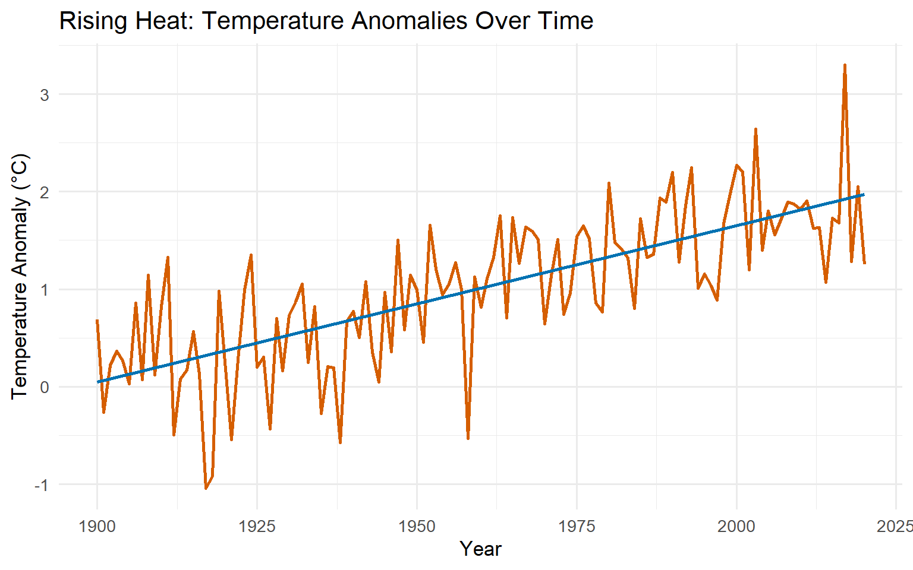

# Burning Point: Climate, Data, and Responsibility

🌏 **The Inferno Down Under: Unravelling a Climate Mystery**

Australia’s *Black Summer* of 2019–2020 was not just another bushfire
season —

it was a national trauma.

➡️ **19 million hectares burned**

➡️ **6,000+ buildings destroyed**

➡️ **34 human lives lost**

➡️ **Over 1.5 billion animals killed**

➡️ **Smoke that circled the globe**

An entire continent seemed ablaze.

At the same time, one question grew louder:

> **Was this simply a horrific natural disaster, or did human-driven
> climate change fuel the flames?**

The scientific community set out to answer this — not through politics,
but through

**attribution science**, data, and climate modelling.

This vignette walks through the findings of van Oldenborgh et al. (2021)
while making the science accessible, visual, and deeply human.

------------------------------------------------------------------------

## 🔍 **Removing the Layers: What the Scientists Did**

Event attribution science compares:

- **World A:** The climate *with* human greenhouse gas emissions

- **World B:** A hypothetical world *without* human emissions
  (pre-industrial)

Researchers used:

✔ **ERA5 reanalysis (1979–2020)** for historic weather

✔ **MODIS satellite imagery** to map burned regions

✔ **11 climate model ensembles** (CMIP5 + CMIP6)

✔ Fire-weather indicators like FWI and TX7x

At the core of the study lies the:

> **Fire Weather Index (FWI)** — a metric for fire danger based on
> temperature, wind, humidity, and rainfall.

------------------------------------------------------------------------

## 🌡️ **A World Heating Up: The Temperature Story**

Here’s a simulated demonstration of how warming trends appear over time:

    `geom_smooth()` using formula = 'y ~ x'

Figure 1: Simulated temperature anomalies in southeastern Australia
(1900–2020), showing a clear warming trend amid natural variability.

🔥 **Finding \#1 — Heatwaves were 1–2°C hotter than they would have been
without human emissions.**

This alone doubled the likelihood of extreme heat events.

🔥 **Fire Risk: How Much Worse Did Climate Change Make It?**

| Climate Scenario              | Probability Ratio | Risk Increase   |
|:------------------------------|:------------------|:----------------|
| Pre-industrial baseline       | 1.0×              | Baseline        |
| Current climate (1°C warming) | 1.3–1.8×          | 30–80% higher   |
| Future (2°C warming)          | 4–8×              | 300–700% higher |

👉 **Even today, climate change has increased extreme fire-weather risk
by at least 30%.**

At +2°C global warming, this increases dramatically.

------------------------------------------------------------------------

## 💨 **Drought: The Surprising Twist**

Heat clearly showed a human fingerprint.

Drought, however, did **not** show a clear anthropogenic trend.

Why?

- 2019 drought was strongly influenced by **natural climate modes**:
  - **IOD (Indian Ocean Dipole)** — extremely positive

  - **SAM (Southern Annular Mode)** — extremely negative

This means **climate change did not directly cause the drought**, but it
magnified the impacts by intensifying heat.

------------------------------------------------------------------------

## 🧩 **Putting It Together: What Really Drove Black Summer?**

✔ Human-driven warming → **increased likelihood of fire-favourable
weather**

✔ Natural variability → **triggered the extreme drought**

✔ Combined effect → **a historically unprecedented fire season**

Even more striking:

> **FWI values reached levels with pre-industrial return periods of over
> 1,000 years.**

We turned a bad year into a catastrophic one.

------------------------------------------------------------------------

## 🖼️ **The Devastation in One Image**

Figure 2: Artist’s impression of Australia burning

A continent glowing with fire.

A reminder that attribution is not just statistics — it is lived
reality.

------------------------------------------------------------------------

## 🚨 **Lessons, Warnings, and What Comes Next**

The science tells us three things:

#### 1️⃣ Climate change is already amplifying extreme fire-weather conditions.

#### 2️⃣ The impacts will worsen at higher warming levels.

#### 3️⃣ Immediate adaptation + mitigation strategies are essential.

This means:

- Stronger fire-management systems

- Better early-warning systems

- Smarter fuel-load management

- Emission reductions to limit future risk

The Black Summer is not just behind us — it is a preview.

------------------------------------------------------------------------

## 📚 **References**

This vignette is based on:

- van Oldenborgh et al. (2021), *Attribution of the Australian bushfire
  risk to anthropogenic climate change*, NHESS

- Dowdy (2018), *Climatological variability of fire weather in
  Australia*
